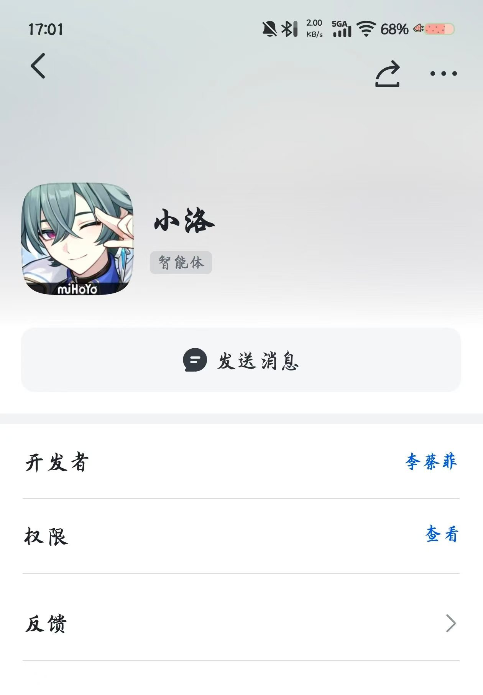
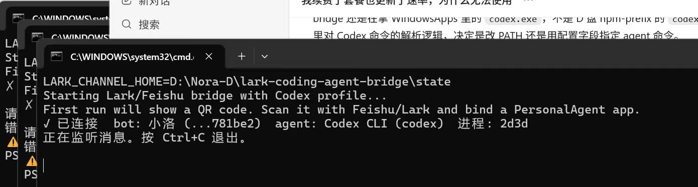
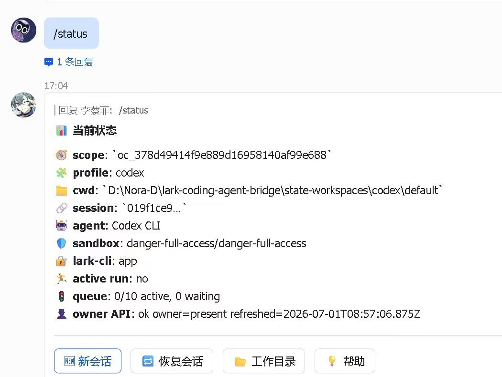

# 01. 搭建飞书 Agent，并把本地 Codex 接进去

这篇只讲接入过程。

目标很明确：让 Codex 不只是在本地 terminal 里跑，而是能进飞书里对话、切目录、继续处理本地项目。

## 一、准备环境

先确认这几样东西已经有了：

1. 本机能正常运行 Codex CLI
2. 已安装 Node.js
3. 有一个飞书 PersonalAgent 应用
4. 能访问 GitHub / npm

如果你不想把这套东西都放在 C 盘，可以单独准备一个目录，比如：

```text
D:\Nora-D\lark-coding-agent-bridge
```

我自己的 bridge 目录结构大概是这样：

```text
D:\Nora-D\lark-coding-agent-bridge
├── npm-prefix
├── npm-cache
├── state
├── logs
└── state-workspaces
```

## 二、安装 `lark-channel-bridge`

先装 bridge：

```bash
npx -y lark-channel-bridge@latest start
```

这是飞书官方文章里给的最基础启动方式。  
参考：

- [飞书官方文章](https://www.feishu.cn/content/article/7647408304896953549)

如果你要固定到自己的目录里，建议把 npm 的 prefix 和 cache 先切走，不然默认会往系统目录写。

例如：

```powershell
$env:npm_config_prefix = 'D:\Nora-D\lark-coding-agent-bridge\npm-prefix'
$env:npm_config_cache = 'D:\Nora-D\lark-coding-agent-bridge\npm-cache'
```

## 三、安装 `lark-cli`

后面飞书文档写入、授权检查、scope 检查都会用到 `lark-cli`，所以这一项最好一起装好：

```bash
npx @larksuite/cli@latest install
```

## 四、第一次启动 bridge

第一次启动的时候，bridge 会让你扫码，把本地 agent 和飞书里的 PersonalAgent 绑起来。

这里的扫码，不是文档权限授权，而是 **先把本地 bridge 和飞书里的智能体入口绑上**。

实际顺序可以按下面走：

### 4.1 启动 bridge

```bash
npx -y lark-channel-bridge@latest start
```

如果你已经把它固定装到了自己的目录里，也可以直接用你自己的启动脚本。

### 4.2 手机扫码绑定 Agent

第一次启动时，终端会提示你扫码绑定飞书 / Lark PersonalAgent。

这一步在手机上完成，扫完之后，飞书里会进入智能体相关页面，后面你就可以继续补：

- 智能体名字
- 头像
- 基本展示信息

你这边当时的智能体页面就是这种效果：



这一步做完以后，bridge 和飞书入口才算真正连上。

启动后如果一切正常，终端里能看到类似这样的状态：



图里能看出几件事：

- `LARK_CHANNEL_HOME` 指向了 bridge 状态目录
- 当前跑的是 Codex profile
- bot 已经绑定成功
- 当前处于监听消息状态

这一步如果没成功，后面飞书里就不会有正常响应。

## 五、飞书里怎么判断它真的连上了

进飞书后，可以直接发：

```text
/status
```

如果接通了，会返回当前 scope、profile、cwd、session、agent、sandbox、queue 这些状态。

例如：



这一步很重要，因为它能确认两件事：

1. 现在回你消息的确实是 bridge 后面的本地 agent
2. 当前工作目录和 profile 是否正确

## 六、常用斜杠命令

飞书官方文章第三部分把 bridge 命令分得很清楚，这里只保留最常用的几条：

### 6.1 会话相关

```text
/new
/new chat
/resume
/status
```

用途：

- 新开会话
- 恢复旧会话
- 查看当前状态

### 6.2 工作区相关

```text
/cd
/ws list
/ws save
/ws use
```

用途：

- 切当前项目目录
- 保存工作区
- 复用之前保存过的工作区

### 6.3 运行控制

```text
/stop
/reconnect
/doctor
```

用途：

- 中断当前任务
- 强制重连
- 诊断当前 bridge 状态

## 七、`/cd` 这一步怎么发

这里单独说一下，因为这一步很容易出错。

正确发法是分两条消息：

第一条：

```text
/cd D:\your-project
```

等它切目录成功后，再发第二条：

```text
请读取这个项目的代码，然后继续处理任务。
```

不要把路径和任务揉成一条消息发，不然 bridge 很容易把后面的中文一起当成路径。

## 八、多 profile 怎么配

如果你只跑一个 agent，其实单 profile 就够了。

如果你要：

- 一个飞书应用跑 Claude
- 另一个飞书应用跑 Codex
- 或者同一台机器同时挂多个 agent

那就需要 profile。

飞书官方文章第四部分给了一个最直接的例子：

```bash
lark-channel-bridge start --profile claude --agent claude
lark-channel-bridge start --profile codex --agent codex
```

这样每个 profile 会有各自的：

- 应用凭据
- 会话
- 工作目录
- 日志

如果你本来就准备分成“小洛”和“艾尔海森”这种不同角色，那建议在这里就分开，不要等后面全都混在一个 profile 里再拆。

## 九、共享上下文怎么做

这一步不要依赖聊天记录本身，最好直接落在本地文件里。

最常见的做法就是在项目目录里放：

```text
AGENTS.md
docs/dev-plan.md
docs/feishu-sync.md
```

这样无论你是从 Desktop 进去，还是从飞书里 `/cd` 进去，最后读到的都是同一套项目说明。
